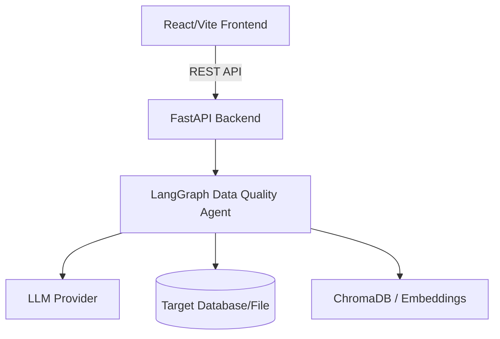

# Architecture

> Generated by /map on 2026-03-07

## Overview
AI Data Quality Agent is a full-stack application designed to autonomously analyze and validate data quality across various sources. It uses a LangGraph-powered intelligent agent to explore data, generate validation rules (deterministic and LLM-assisted), and provide comprehensive data quality reports.

## System Diagram

## Components

### Frontend (User Interface)
- **Purpose:** Provide a user interface to configure data sources, run validations, and view data quality reports/charts.
- **Location:** `frontend/src`
- **Dependencies:** React, React Router, Zustand (state management), Recharts (visualization), TailwindCSS (styling).
- **Dependents:** End-users.

### Backend API (FastAPI)
- **Purpose:** Expose REST API endpoints to the frontend, managing validations, rules, and data sources.
- **Location:** `backend/app/api`
- **Dependencies:** FastAPI, Uvicorn, Pydantic.
- **Dependents:** Frontend Application.

### Data Quality Agent
- **Purpose:** Complex reasoning engine that coordinates connection to data sources, running profile queries, and evaluating data against dynamically generated rules.
- **Location:** `backend/app/agents`
- **Dependencies:** LangGraph, LangChain, underlying LLMs.
- **Dependents:** Backend API.

### Connectors
- **Purpose:** Abstract data access for various sources (SQLite, CSV, AWS, Azure, Postgres).
- **Location:** `backend/app/connectors`
- **Dependencies:** Pandas, SQLAlchemy, PyArrow, Boto3, Azure SDK.
- **Dependents:** Data Quality Agent.

## Data Flow
1. User creates a data source configuration via the UI.
2. User initiates a Validation Run.
3. FastAPI receives the request and triggers the `DataQualityAgent` (LangGraph).
4. Agent connects to the target data source via appropriate `Connector`.
5. Agent discovers the schema and analyzes data samples.
6. Agent logic branches to Pre-built exact tests (e.g., SQLite `COUNT(*)`) and LLM custom tests.
7. Results are aggregated, a quality score is generated, and a report is saved.
8. Frontend fetches and visualizes the structured report.

## Integration Points
| External Service | Type | Purpose |
|------------------|------|---------|
| LLM Providers | API | Used by LangChain for agentic reasoning and custom rule generation (e.g. Gemini, Groq, OpenAI, Ollama). |
| Vector Store | DB | ChromaDB for RAG context storage (persisting schema knowledge). |

## Conventions
- **Naming:** `snake_case` in Python backend, `camelCase` and `PascalCase` in TS frontend.
- **Structure:** Separated Monorepo (`backend/` and `frontend/`).
- **Testing:** Pytest for python backend.

## Technical Debt
- [ ] No major documented TODOs/FIXMEs found internally in `src` or `app` directories.
